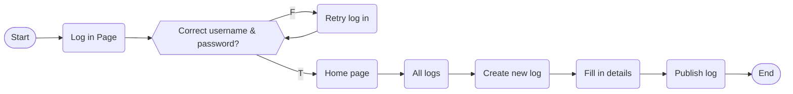

# Con Brio

> ***con brio*** /kɒn ˈbriːəʊ/ 
>  (Italian, music) with vigour

Con Brio is a student management app designed for freelance music teachers to store lesson plans, record student progress, communicate with parents and keep track of schedules & invoices.

  
<i>[Click to show/hide table of contents]</i>

  
  ## Contents
  
  1. [Ideation](#ideation)
      1. Problem
      2. Solution
      3. User Stories
  2. [Planning](#planning)
      1. Milestones
      2. User Flows
      3. Wireframes
      4. Database ERD
  3. Deployment *(to be updated)*
  4. Technologies

## 💡 Ideation

### Problem
Freelance music teachers who teach 1:1 lessons usually have students all at different stages of progress. This makes it **tedious for teachers to keep track and plan lessons** for each individual student. Also, most teachers schedule for back-to-back classes during peak periods (after-school hours, weekends). This leaves **insufficient time to communicate with parents or keep proper records of lesson logs** after each lesson, risking delays that will snowball and disrupt the schedule for the remainder of the day. Lastly, as a freelancer, there is also the **administrative hassle of updating schedules, creating invoices and sending payment reminders to parents** which are usually done on separate applications and is inefficient.   

> **Problem Statement:** Freelance music teachers need a way to quickly record lesson progress and communicate it to parents after every lesson to ensure accountability without risking delays between classes. They also need a way to efficiently settle scheduling and invoicing so that they can focus on improving lessons instead.

### Solution
App that allows:
- Creating, editing and deleting lesson logs that can be shared with parents (by teacher)
- Viewing and commenting on lesson logs (by parent)
- Keeping track of lesson dates (by teacher)
- Generating invoices based on lesson dates that can be shared with parents (by teacher)

### User Stories
* Salieri, a music teacher, creates a lesson log detailing contents covered in class and things for the student to work on before the next lesson. He is able to edit and delete this log, as well as share it with the respective parent.
* Johann van Beethoven, a parent, can view each lesson log and leave a comment to acknowledge or ask questions about his child.

## 🗓 Planning

### Milestones

| Milestone            | Deliverables                                               |
| -------------------- | ---------------------------------------------------------- |
| **Base (MVP)**       | Sign up/log in, user authentication functionalities        |
|                      | CRUD for lesson logs                                       |
|                      | CRUD for comments                                          |
|                      | Generate "invoice-like" page based on lesson logs recorded |
| **Comfortable**      | Tidy up CSS                                                |
|                      | Calendar view for scheduling                               |
|                      | Statistics for income tracking (Graph.js)                  |
|                      | Generate PDF for invoices (npm library)                    |
| **More Comfortable** | Save lesson plan templates and retrieve it in lesson logs  |
|                      | Web sockets for messaging, notifications of comments       |
|                      | Generate email to send invoices (npm library)              |

### User Flows

##### Create new lesson log (Teacher)

##### View lesson log and leave comment (Parent)

### Wireframes
[View Wireframes](https://drive.google.com/file/d/173N1Xem9EaWMg4IrgO-2QAZBPU_4b0g3/view?usp=sharing)

### Database ERD
[View ERD](https://drive.google.com/file/d/11Xsvae4SLt175mFQGj3LET5Qf-hs8fi8/view?usp=sharing)
